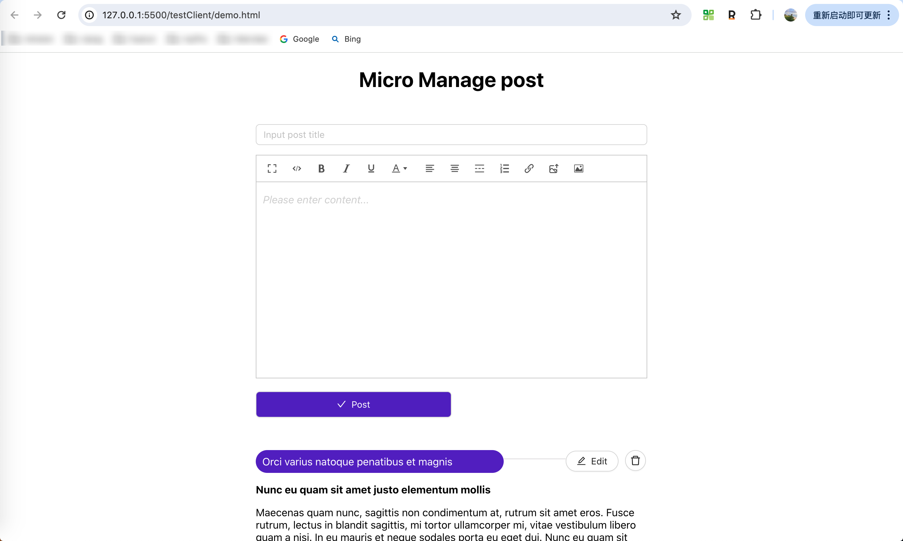

## micro-react-editorList

### 1.install

```bash
  yarn install
```

### 2.run

```bash
npm run build:local
npm run start
# 打开预览 testClient/demo.html查看微服务效果
# http://127.0.0.1:5500/testClient/demo.html
```

### 3.preview
